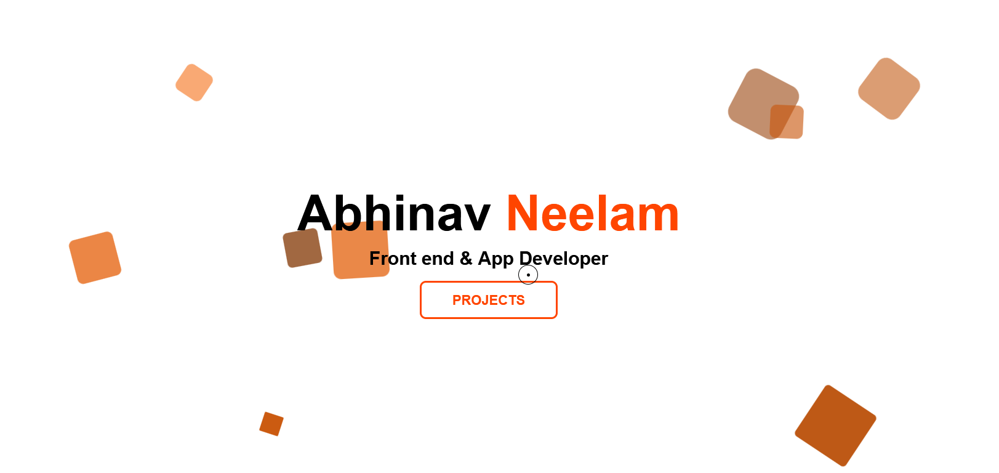

## Portfolio

My portfolio page is created with the classic web stack using HTML, CSS and Javascript.

### Screenshot

### Link

The portfolio is live at [Github Pages](https://lonecoder21.github.io/Portfolio/)

### Icons

All the icons are from [Iconify](https://icon-sets.iconify.design/).

### Rotating Squares

The inspiration behind the rotating squares are from this [codepen](https://codepen.io/alvarotrigo/pen/GRvYNax). I also added some color variance around it to amplify the background look. I decided to use Javascript instead of hard coding like the code pen did which produced shorter code and more control.
